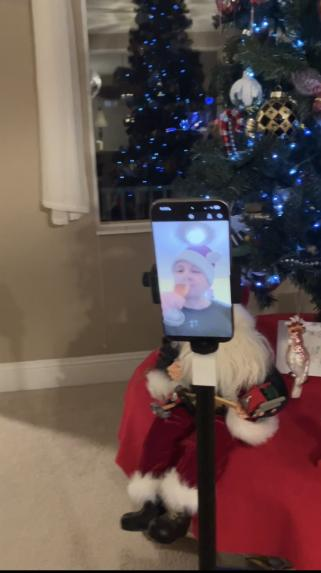
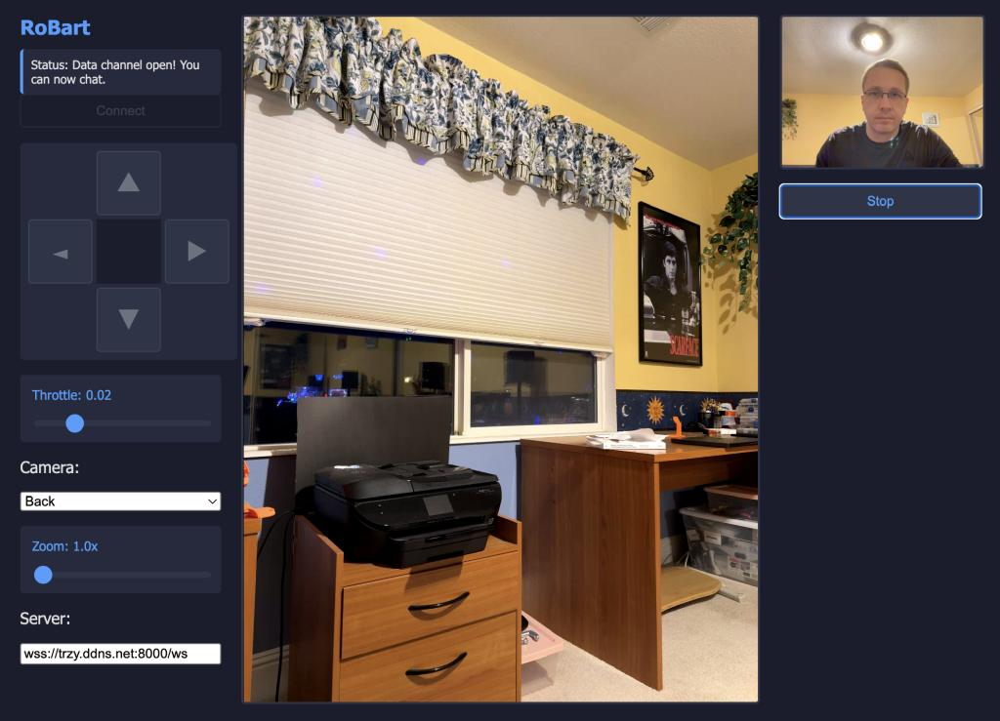

# RoBart: iPhone-based Robot with WebRTC Remote Teleoperation
*Copyright 2024-2026 Bart Trzynadlowski*

This is the `webrtc-teleop` branch of RoBart. Please [see here](https://github.com/trzy/RoBart) for the main branch containing VLM-controlled RoBart. This branch contains a simple implementation of WebRTC-based teleoperation for RoBart. All of the VLM and AR features have been removed.

<table align="center">
  <tr>
    <td align="center"><a href="https://www.youtube.com/shorts/HwhRln_GHCM"></a></td>
  </tr>
  <tr>
    <td align="center"><a href="https://www.youtube.com/shorts/HwhRln_GHCM">Happy 2026 from teleoperated RoBart!</a></td>
  </tr>
</table>

## Usage

### Basic Usage

To use it, start the simple Python signaling server (after installing `requirements.txt`):

```
python -m server
```

Then, open [http://localhost:8000](http://localhost:8000) for the teleop interface. The WASD keys on the keyboard control the robot. If the remote peer is the iOS client (RoBart), the camera and zoom can be changed. The camera selections are currently hard-coded and the fallback, in case the selected camera does not exist on the iPhone model, is the back camera.

<table align="center">
  <tr>
    <td align="center"><a href="https://www.youtube.com/watch?v=qaFw_k8H3FY"></a></td>
  </tr>
  <tr>
    <td align="center"><a href="https://www.youtube.com/watch?v=qaFw_k8H3FY">Teleoperating RoBart from a laptop.</a></td>
  </tr>
</table>

Finally, launch the iOS app, which will automatically try to connect via the signaling server. Ensure the IP address used by the iOS app matches where the server is running. It may take a while for the WebRTC stream to stabilize, even on a home LAN, but after 30 seconds to a minute, it should be perfectly usable.

### TLS (HTTPS) Support

Certificates can be loaded using `--cert-dir` to specify the directory they are located in. This is useful for access outside of a LAN via a domain name. A free domain name for home IP addresses can be obtained with [No-IP](https://no-ip.com), and [DuckDNS](https://duckdns.org), or similar services, and then [Certbot](https://github.com/certbot/certbot) can be used to generate a certificate.

```
python -m server --cert-dir=.
```

In this example, the server will look for `fullchain.pem` and `privkey.pem` in the current directory. When using this option, make sure to use the `https` form of the URL with the domain name corresponding to the certificate (e.g., [https://mydomain.ddns.net:8000](https://mydomain.ddns.net:8000)).

### TURN Servers

ICE servers are provided to clients by the signaling server. STUN servers are hard-coded to public Google servers for now but TURN servers can be
supplied using `--turn-servers`, which takes a comma-delimited list of server addresses along with the protocol prefix (`turn:` or `turns:`, depending on whether TLS is required) and port number. Optionally, credentials may be provided with `--turn-users` and `--turn-passwords`.

```
python -m server --turn-servers=turn:192.168.0.101:3478,turns:myturnserver.domain.com:5349 --turn-users=user1,user2 --turn-passwords=pass1,pass2
```

To force the clients to use a TURN relay (ICE transport policy of `relay` rather than `all`), `--relay` can be used. The server sends `ServerConfigurationMessage` to clients in order to establish their role (initiator or responder), the ICE servers, whether to use relay mode, and to signal that the connection process may begin.

## Future Work

- The connection flow can surely be made more robust. There are probably edge cases where a client (particularly the iOS one) can get stuck
  indefinitely. I am fairly confident these are fixable and that `AsyncWebRtcClient`'s state machine approach is sufficiently flexible.
- The signal server can easily be improved to support more than a single client pair at a time using some sort of session or "room" ID to match
  them.
- Reintroduce AR and spatial mapping. This will require learning how to construct the video stream at a lower level and manually inputting frames.