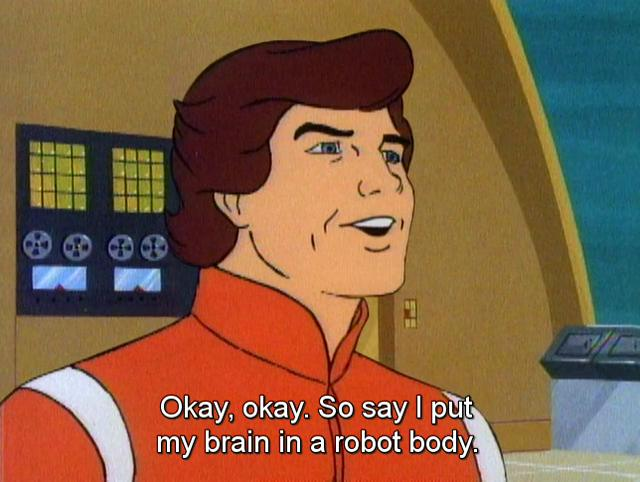
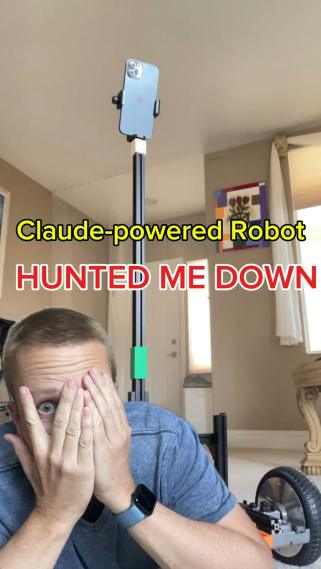
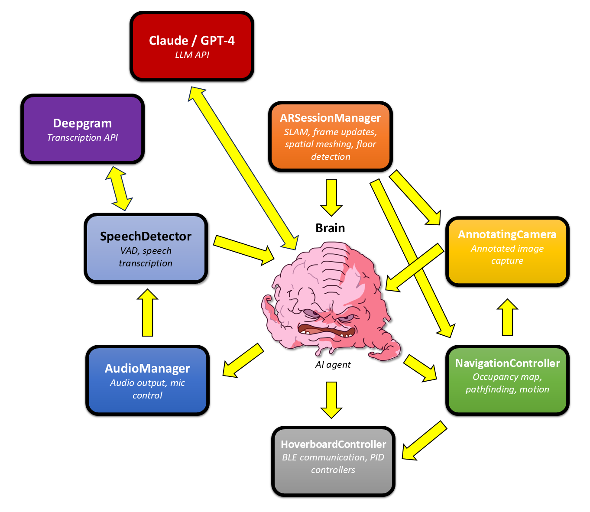
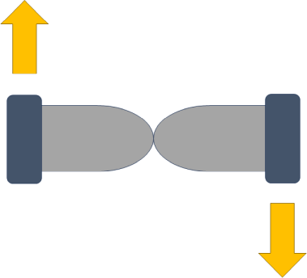
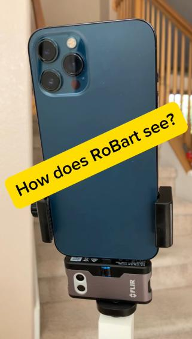
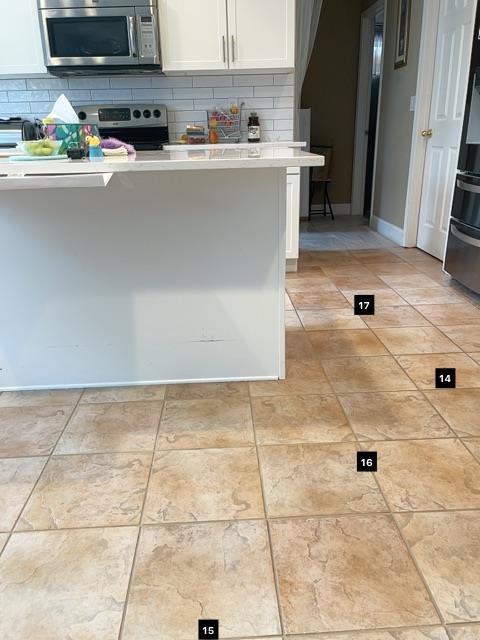

# RoBart: Autonomous LLM-controlled robot using iPhone
*Copyright 2024 Bart Trzynadlowski*

**What if you could put your brain in a robot body?** Okay, okay, that's not possible, but what if you could put Claude or GPT-4 in a robot body? And not just any robot body but a robot body based on a salvaged hoverboard and an iPhone Pro for compute and sensors? That's exactly what I did. Read on, human!

<p align="center"></p>

<table align="center">
  <tr>
    <td align="center"></td> <td align="center"></td>
  </tr>
  <tr>
    <td align="center">Hide and seek</td> <td align="center">Hide and seek</td>
  </tr>
</table>

## Objectives

RoBart began as an attempt to build a cheap mobile base using a hoverboard and iPhone Pro. Mobile phones are easy to work with and provide plenty of compute, connectivity, and useful peripherals: RGB cameras, LiDAR, microphones, speakers. Using [ARKit](https://developer.apple.com/augmented-reality/arkit/), we get SLAM, scene understanding, spatial meshing, and more. Let's see what we can do with this!

I'm open sourcing this project to stimulate discussion and encourage exploration. Some topics to consider:

- **Navigation:** RoBart needs better motion planning and navigation, particularly in household environments. An initial step would be to build a proper [nav mesh](https://en.wikipedia.org/wiki/Navigation_mesh) from its occupancy maps. Proper motion planning would be next.
- **Agent:** The agent could easily be improved with better planning, long-term memory, and spatial awareness. [Vision fine-tuning with GPT-4o](https://openai.com/index/introducing-vision-to-the-fine-tuning-api/) opens up all sorts of exciting possibilities.
- **Mechanical Design:** The mechanical design is a one-off. Can we design a simpler robot that's easier to replicate entirely from off-the-shelf and 3D-printed parts? Virtually nothing would need changing in the code.
- **Manipulation:** A RoBart Mk II should include an end effector, maybe something like this [5-dof Waveshare arm](https://www.waveshare.com/roarm-m1.htm) or the [SO-ARM100](https://github.com/TheRobotStudio/SO-ARM100).
- **Applications:** Accessibility? Tidying-up? Contactless health? Home inspection and security? A robotic porter? What are some fun ideas that could be built?

If you have ideas or contributions, I encourage you to reach out!

## System Architecture

RoBart is a bit of a fever dream of ideas, many only partly finished. I'll attempt to describe how the code base works here.

### High-Level Overview

The RoBart code base contains four distinct applications, only two of which constitute the robot:

1. **iOS application:** This is the main RoBart app that runs on iPhone and controls RoBart. It does not rely on a companion server and makes calls to public LLM APIs directly. The app actually has two modes: robot and handheld, the latter localizing itself to the same SLAM map and allowing for remote control. Located at `ios/RoBart/`.
2. **Arduino firmware:** Firmware that runs on the [Adafruit Feather nRF52 Bluefruit LE](https://www.adafruit.com/product/3406?g=&gad_source=1&gclid=CjwKCAiA3ZC6BhBaEiwAeqfvykMG2eNFgYPQH7afzyBHNYS5us6RZF8WMFso22wj9rWsmRq58V3ItRoC2-QQAvD_BwE) to control the motors. Communicates with the iOS app via Bluetooth Low Energy. Located at `hoverboard/`.
3. **watchOS application:** An optional Apple Watch app that allows voice commands to be issued from Watch. This is useful in noisy environments that confound the VAD running on the iPhone. Located at `ios/RoBart/` as a watchOS build target.
4. **Debug server:** A Python-based server that the iOS app will attempt to connect to. Provides an interactive terminal that allows various debug commands to be issued, both to control the robot and request data from it. This is not required to operate the robot. Located at `server/`.

The main components of the RoBart iOS app are shown in the diagram below.

<table align="center">
  <tr>
    <td align="center"></td>
  </tr>
  <tr>
    <td align="center">RoBart iOS app architecture.</td>
  </tr>
</table>

The components are:

- **ARSessionManager:** Using ARKit, publishes camera transform and frame updates, performs scene meshing and floor plane detection, and even supports collaborative sessions with other phones running the app in handheld mode. RoBart components frequently poll the current camera transform or wait for the next frame.
- **SpeechDetector:** Listens for spoken audio, transcribes it using Deepgram, and then publishes the resulting transcript. An external transcription API is used because iOS's `SFSpeechRecognizer` is performance intensive.
- **AudioManager:** Plays audio samples (i.e., RoBart's spoken utterances) and controls the microphone (used by `SpeechDetector`).
- **HoverboardController:** Executes trajectories (e.g., rotate N degrees, drive forward N meters) using PID control on iOS and by sending motor throttle commands to the hoverboard Arduino firmware via BLE.
- **NavigationController:** Higher-level motion control and navigation. Builds an occupancy map, performs very crude pathfinding, provides a nearest-human following task, and executes motion tasks using `HoverboardController`.
- **AnnotatingCamera:** Takes photos and annotates them with navigable points (using the occupancy map). This allows the AI agent to reason about where it can move.
- **Brain:** The AI agent that runs RoBart. Listens for speech and will then attempt to complete the requested task using all of RoBart's capabilities and the chosen LLM.

### Motor Control

`HoverboardController` communicates with the Arduino firmware via BLE. It sends individual motor throttle values (ranging from -1.0 to +1.0, with sign indicating direction) directly. A number of basic trajectory commands are handled on iOS by employing a PID controller that uses ARKit's 6dof pose for feedback (yes, running a PID loop like this through BLE and with ARKit's latency is engineering malpractice but it almost works). These include:

- **drive:** Sets the individual throttle values for the left and right motors, open loop.
- **rotateInPlace:** Turns in place with the given angular velocity (-1 being left at full throttle and +1 being right at full throttle), open loop.
- **rotateInPlaceBy:** Rotates in place by a specified number of degrees.
- **face:** Turns in place to face the given world space direction vector.
- **driveForward:** Drive forward by the specified distance in meters.
- **driveTo:** Drives to the specified world space position in a straight line, both turning to face the point and moving towards it.
- **driveToFacing:** Drives to the specified position while facing the given direction. Particularly useful for driving backwards to a point.

<table align="center">
  <tr>
    <td align="center"></td>
  </tr>
  <tr>
    <td align="center">Schematic top-down view of the hoverboard. Rotating right can be accomplished with multiple commands, e.g., <b>drive(leftThrottle: 1, rightThrottle: -1)</b>.</td>
  </tr>
</table>

There is currently no feedback on the Arduino side. No encoder is present on the motors. A watchdog mechanism exists that will cut motor power when either the BLE connection is lost or if motor throttle values are not updated within a certain number of seconds. In the PID controlled modes, a stream of constant updates is sent, which prevents the watchdog from engaging. 

### Position Tracking and Mapping with ARKit

[ARKit](https://developer.apple.com/augmented-reality/arkit/) provides [SLAM](https://en.wikipedia.org/wiki/Simultaneous_localization_and_mapping) for 6dof position and a slew of other useful perception capabilities. The `ARSessionManager` singleton, found in `ios/RoBart/RoBart/AR/ARSessionManager.swift`,
handles the AR session and exposes various useful properties. [RealityKit](https://developer.apple.com/documentation/realitykit) is used for debug rendering of meshes and planes. The AR session is initiated from the AR view container in `ios/RoBart/RoBart/Views/AR/ARViewContainer.swift`

For collision avoidance, RoBart constructs an occupancy map. This is a regular 2D grid on the xz-plane indicating cells that contain world geometry. It is computed by taking all of the vertices produced by scene meshing (see [`ARMeshAnchor`](https://developer.apple.com/documentation/arkit/armeshanchor)) and using a [Metal](https://developer.apple.com/metal/) compute shader to project them onto a 2D grid. The resulting map is used to test for obstructions and plot paths. The occupancy map code is found in `ios/RoBart/RoBart/Navigation/Mapping/`. In order to build it, RoBart needs to know the floor height (i.e., its world-space y component) because the occupancy map is computed by looking for obstacles that are within a certain height range above the floor.

<table align="center">
  <tr>
    <td align="center"></td>
  </tr>
  <tr>
    <td align="center">Occupancy map and paths as RoBart explores my house.</td>
  </tr>
</table>

### Photo Input

<table align="center">
  <tr>
    <td align="center"><a href="https://www.youtube.com/shorts/68BlqNpVZNE"></a></td>
  </tr>
  <tr>
    <td align="center"><a href="https://www.youtube.com/shorts/68BlqNpVZNE">How does RoBart see?</a> A video explaining how photos are used in conjunction with the navigation system.</td>
  </tr>
</table>

`AnnotatingCamera` takes photos captured by ARKit (which include the camera pose and camera intrinsics) and annotates them with *navigable points*. This is performed by first placing a series of fixed points on the floor (recall that the floor elevation is provided by `ARSessionManager`) in 3D space near the robot and then determining which of these are *navigable*. That is, points reachable from the current position without obstruction, as indicated by the occupancy map. Finally, the navigable points are projected onto the 2D photo using the camera intrinsics and rendered as numbers atop black rectangles on the image. These annotated images allow the LLM to generate specific instructions for navigation.

<table align="center">
  <tr>
    <td align="center"></td>
  </tr>
  <tr>
    <td align="center">Navigable points in the kitchen.</td>
  </tr>
</table>

### Voice Input

Two methods of voice input are provided:

1. The iOS app can listen directly to the microphone. The WebRTC VAD (voice activity detector) is used to detect human speech. Speech is uploaded to [Deepgram](https://www.deepgram.com) for transcription. An API key must be provided in the settings view. The built-in `SFSpeechRecognizer` could have been used but given how intensively ARKit is used, it would add even more computational load. The big drawback of the current system, however, is that the VAD is not very good, especially in noisy settings.
2. A Watch app target is provided that allows Apple Watch to be used as a microphone. Audio is streamed to the iOS app seamlessly via [Watch Connectivity](https://developer.apple.com/documentation/watchconnectivity). Because recording is manually started and stopped, this is much more reliable and I frequently use this when giving demos of RoBart outside the home.

### Agent Loop

RoBart uses a very simple ReAct-like (reason and act) prompting method for its agent. A great overview of ReAct prompting [exists here](https://github.com/williamcotton/empirical-philosophy/blob/main/articles/how-react-prompting-works.md). Rather than merely interleaving *thought* and *observation* sections, a number of specialized sections are generated using XML tags. A parser parses these into `ThoughtRepresentable` objects (all of this code is in `ios/RoBart/RoBart/Brain/`), which can later be serialized back into the message format expected by the LLM (OpenAI's and Anthropic's APIs differ). Having a parsed list of objects makes it easy to programmatically insert sections and prune the context by discarding old ones. To illustrate exactly how the agent works, I asked RoBart to "look directly behind you and describe what you see." Below is the complete message sequence sent to Claude. This particular example involved five steps:

1. The transcribed speech was wrapped in a `<HUMAN_INPUT>` section along with a photo from that moment and sent to Claude.
2. As per its system instructions, the agent responded with `<PLAN>`, `<MEMORY>` (initially empty), `<INTERMEDIATE_RESPONSE>`, and finally, `<ACTIONS>` containing actions to perform.
3. The two actions were executed in sequence: turn 180 degrees, take photo.
4. An `<OBSERVATIONS>` section was appended and send to Claude. This contains the photo taken by the `takePhoto` command as well as some textual information about how RoBart moved and its final position.
5. The agent responded with `<FINAL_RESPONSE>` because the task was completed successfully.

```
<HUMAN_INPUT>look directly behind you and describe what you see
photo0: <image>
</HUMAN_INPUT>

<PLAN>
- Long-term plan: Turn 180 degrees to look behind current position and describe what's there
- Current observations: I am currently facing some area but need to turn to see behind
- Sub-problem: Execute a simple turn and take a photo
- Progress: Haven't started yet but straightforward task
- Information needed: Just a photo of what's behind current position
- Capabilities to use: turnInPlace and takePhoto
- Steps:
  1. Turn 180 degrees
  2. Take a photo
  3. Describe what I see
</PLAN>

<MEMORY>
[]
</MEMORY>

<INTERMEDIATE_RESPONSE>
I will turn around to look behind me.
</INTERMEDIATE_RESPONSE>

<ACTIONS>
[
    {"type": "turnInPlace", "degrees": 180},
    {"type": "takePhoto"}
]
</ACTIONS>

<OBSERVATIONS>Turned -175.16881 degrees
Took photo photo1
Current position: (x=0.10 meters,y=0.11 meters)
Current heading: 6 deg
Current view, photo1 taken during last actions step: <image>
</OBSERVATIONS>

<FINAL_RESPONSE>I see a music area with a keyboard, a speaker mounted on the wall, a chair, and some storage containers against a yellow wall with a decorative border.</FINAL_RESPONSE>
```

## Mechanical and Electrical Design

The RoBart iOS code is only very weakly dependent on the actual physical form factor of the robot. It would be trivial to build a very different mobile platform. Here, I'll loosely describe the platform I use (which I received some invaluable help from a friend at [BridgeWire](https://bridgewire.org/)).

### Mechanical Design

RoBart is based on the [Hover-1 H1](https://www.amazon.com/Hover-1-Electric-Balancing-Hoverboard-Scooter/dp/B0DJQ6996R) with plastic shell and original electronics removed. Aluminum extrusions are used to create a frame to which a rear caster and the iPhone are attached.

There is a 3D-printed mount for the phone holder atop the vertical extrusion. The extrusion itself has been cut and joined with a removable plastic connector in order to allow RoBart to be transported in the trunk of a car.

### Electrical Design

#### Bill of Materials


